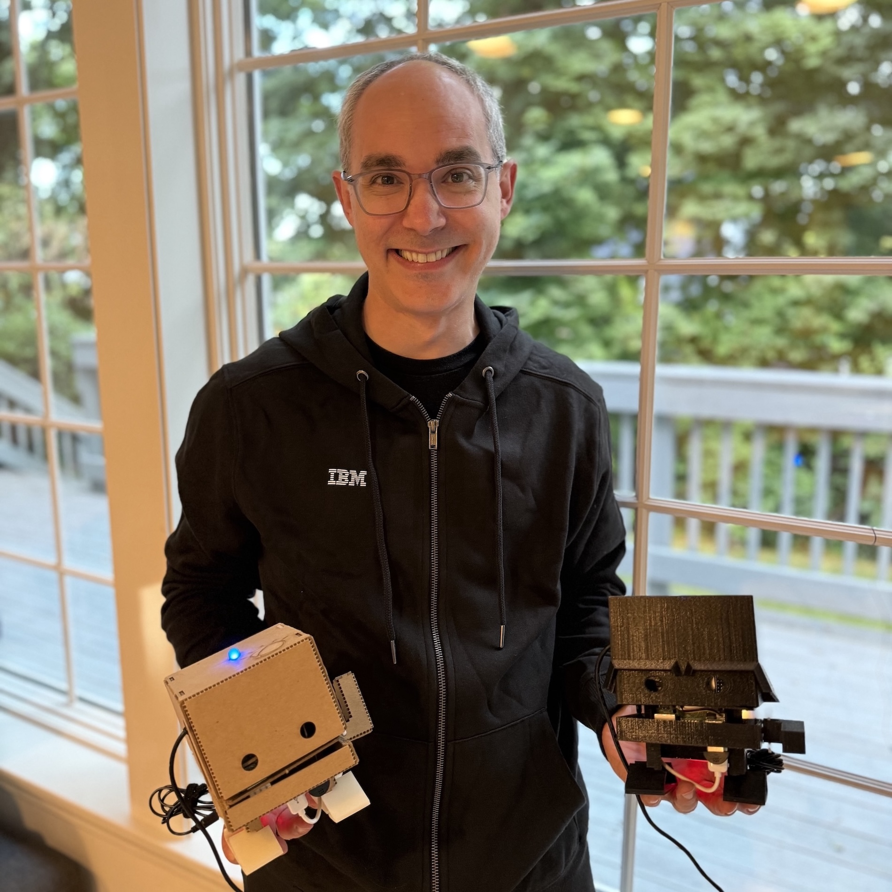
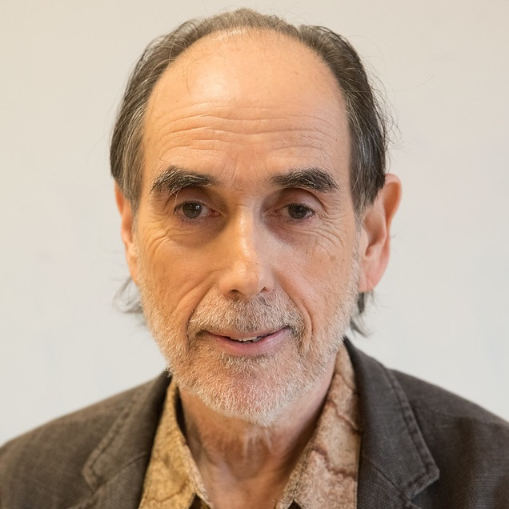
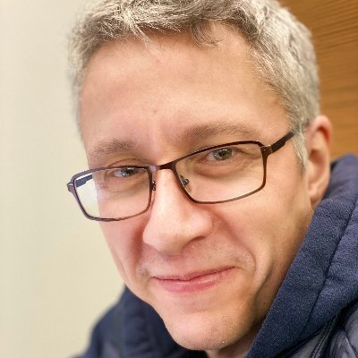

# Organizers {#organizers}

AgentCraft 2026 is organized by:

    

        

            
        

        

            <h3>Karthik Dinakar</h3>
            
Pienso, USA

            

                <a href="https://cyber.harvard.edu/people/karthik-dinakar-0"><i class="fa-solid fa-lg fa-house"></i></a>
                <a href="https://www.linkedin.com/in/karthikdinakar/"><i class="fa-brands fa-lg fa-square-linkedin"></i></a>
            

        

    

    
Karthik is co-founder and CTO of <a href="http://pienso.com">Pienso Inc</a>. He was the co-organizer of the MIND (Mixed Initiative Next-gen Design) Workshop at IUI 2025 which explored the implications of the "Agents vs. Direct Manipulation" debate for making auto-regressive LLMs end-user accessible.

    

        

            
        

        

            <h3>Justin D. Weisz</h3>
            
IBM Research, USA

            

                <a href="https://research.ibm.com/people/justin-weisz"><i class="fa-solid fa-lg fa-house"></i></a>
                <a href="https://hci.social/@jweisz"><i class="fa-brands fa-lg fa-mastodon"></i></a>
                <a href="https://www.linkedin.com/in/jweisz3/"><i class="fa-brands fa-lg fa-square-linkedin"></i></a>
                <a href="https://medium.com/human-centered-ai"><i class="fa-solid fa-lg fa-blog"></i></a>
            

        

    

    
Justin Weisz is a Senior Research Scientist, Manager, and Strategy Lead for Human-Centered Trustworthy AI at IBM Research. Dr. Weisz’s research focuses on understanding how to design AI systems that amplify and augment human capabilities. He was a co-organizer of <a href="https://hai-gen.github.io">HAI-GEN @ IUI</a> (2021-2025).

    

        

            
        

        

            <h3>Henry Lieberman</h3>
            
MIT CSAIL, USA

            

                <a href="https://web.media.mit.edu/~lieber/"><i class="fa-solid fa-lg fa-house"></i></a>
                <a href="https://www.linkedin.com/in/henry-lieberman/"><i class="fa-brands fa-lg fa-square-linkedin"></i></a>
            

        

    

    
Henry Lieberman is a Research Scientist at MIT CSAIL, whose contributions span the fields of programming languages, artificial intelligence and human-computer interaction. He was twice Program Chair of IUI, and is one of the most prolific authors of IUI papers. He also served a term on the Executive Council (Board of Directors) of AAAI. He received the 2018 IUI Impact Award.

    

        

            
        

        

            <h3>Werner Geyer</h3>
            
IBM Research, USA

            

                <a href="https://research.ibm.com/people/werner-geyer"><i class="fa-solid fa-lg fa-house"></i></a>
                <a href="https://twitter.com/wernergeyer"><i class="fa-brands fa-lg fa-square-x-twitter"></i></a>
                <a href="https://www.linkedin.com/in/wernergeyer"><i class="fa-brands fa-lg fa-square-linkedin"></i></a>
            

        

    

    
Werner Geyer is a Principal Research Scientist, ACM Distinguished Member at IBM Research in Cambridge, MA. He has held various roles as co-chair at ACM RecSys. He has been co-organizer of <a href="https://hai-gen.github.io">HAI-GEN</a> since 2020. His recent research interests include the use of generative AI in business settings and understanding how to effectively design AI-assisted agentic workflows to augment peoples' abilities

## Program Committee {#program-committee}

- Victor Dibia, Microsoft Research
- Thariq Shihipar, Anthropic (Claude Code)
- Simret Gebreegziabher, Notre Dame University
- Sebastian Gehrmann, Bloomberg
- Harang Ju, Johns Hopkins University
- Steve Ross, IBM Research
- Daniel Karl Weidele, IBM Research
- Patrick Xian, Northeastern University
- Zhiping Zhang, Northeastern University
- Brian Cort, Pienso Inc
- Arnav Nagpal, Pienso Inc
- Sonia Wu, Pienso Inc
- Mathew Maradin, Pienso Inc

## Contact {#contact}

For questions, please contact the organizers at [agentcraft-iui@gmail.com](mailto:agentcraft-iui@gmail.com).
